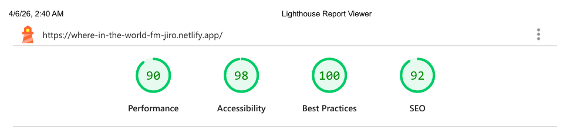

# Where In The World

[](https://react.dev)
[](https://vitejs.dev)
[](https://tailwindcss.com)
[](https://vitest.dev)
[](https://testing-library.com)
[](https://www.typescriptlang.org/)
[](https://mswjs.io)
[](https://reactrouter.com/)


[](https://www.frontendmentor.io/)
[](https://git-scm.com/)
[](https://github.com/)
[](https://www.netlify.com/)
[](https://chrome.google.com/webstore/detail/perfectpixel-by-welldonecod/dkaagdgjmgdmbnecmcefdhjekcoceebi)


[](https://restcountries.com/)
[](/docs/downloads/lighthouse-performance-report.pdf)


## Where In The World - Searh Countries Powered By REST Countries API

A fully responsive country explorer built with React and TypeScript, featuring dynamic data fetching, URL-driven filtering, and comprehensive testing using MSW.

| _Mobile Preview (375x812)_                                  | _Desktop Preview (1440x960)_                                   |
| ----------------------------------------------------------- | -------------------------------------------------------------- |
|       |       |
|  |  |

---

## Overview

This project is a production-style implementation of the **[REST Countries API](https://restcountries.com/)** which allows users to explore countries by name, filter by region, and view detailed country information including borders, currencies, and languages.

It emphasizes clean data flow, URL-driven state management using React Router, and robust testing using Mock Service Worker (MSW) to simulate real API behavior.

Created as part of the building challenges from **[Frontend Mentor](https://www.frontendmentor.io/)**.

---

## Live Demo

You can check out the live website **[here](https://where-in-the-world-fm-jiro.netlify.app/)**

---

## Features

- Browse all countries with dynamic data fetched from the **[REST Countries API](https://restcountries.com/)**
- Search countries with debounced, case-insensitive input
- Filter countries by region with toggleable dropdown
- URL-based state management for persistent search and filters using **[React Router](https://reactrouter.com/)**
- Detailed country pages with dynamic routing (`/country/:code`)
- Navigate between countries via border country links
- Light/Dark theme toggle with system preference detection and persistence
- Optimized rendering using derived state and memoization
- Clean architecture using service layer, formatter utilities, and custom hooks
- Full UI state handling (loading, error, empty, success)
- Comprehensive testing with Vitest, React Testing Library, and MSW
- Accessibility improvements including semantic structure, ARIA attributes, and keyboard navigation
- Fully responsive layout with mobile-first design

---

## Tech Stack

**Libraries & Frameworks:** [](https://react.dev/)
[](https://tailwindcss.com/)
[](https://reactrouter.com/)

**Core Technologies:** [](https://developer.mozilla.org/en-US/docs/Web/HTML)
[](https://developer.mozilla.org/en-US/docs/Web/CSS)
[](https://www.typescriptlang.org/)
[](https://www.markdownguide.org/)

**Tooling & Testing:** [](https://vitejs.dev/)
[](https://vitest.dev/)
[](https://testing-library.com/docs/react-testing-library/intro/)
[](https://mswjs.io)

**Platforms & Deployment:** [](https://git-scm.com/)
[](https://github.com/)
[](https://www.netlify.com/)
[](https://code.visualstudio.com/)

---

## Development Workflow

This project uses a **[feature-based branching workflow](https://github.com/CodingWithJiro/frontend-mentor-where-in-the-world/network)** with descriptive commits and **[structured pull requests](https://github.com/CodingWithJiro/frontend-mentor-where-in-the-world/pulls?q=is%3Apr+is%3Aclosed)**, mirroring professional team collaboration practices:

[](https://github.com/CodingWithJiro/frontend-mentor-where-in-the-world/network)

---

## Performance Report

[](docs/downloads/lighthouse-performance-report.pdf)

A **Google Lighthouse** audit was conducted on the final version of this project. You can view the **[full report here](docs/downloads/lighthouse-performance-report.pdf)**.

---

## How to Run

Open a terminal and type:

```bash
git clone https://github.com/CodingWithJiro/frontend-mentor-where-in-the-world.git
cd frontend-mentor-where-in-the-world
npm install
npm run dev
```

---

## Testing

Open a terminal and type:

```bash
npm test
```

---

## What I Learned

- Structured a scalable React application using separation of concerns (API layer, hooks, utilities, UI)
- Strengthened TypeScript fundamentals including generics, shared types, and strict typing for props and state
- Learned to design clean data transformation layers to convert complex API responses into UI-ready data
- Implemented URL-driven state management using `useSearchParams` for persistence and better UX
- Understood how to design filtering pipelines combining multiple conditions (search + region)
- Improved performance using derived state and `useMemo` where appropriate
- Built reusable and accessible UI components with proper semantic HTML and ARIA practices
- Gained deeper understanding of React Router including nested routes, dynamic routing, and navigation patterns
- Learned how to handle async data flows with proper loading, error, and empty states
- Practiced debouncing and syncing UI state with URL state
- Implemented real-world testing strategies using Vitest and React Testing Library
- Mastered API mocking using Mock Service Worker (MSW) for integration testing
- Learned how to simulate full async UI lifecycles and edge cases in tests
- Improved debugging skills for async rendering and state issues
- Developed a stronger understanding of frontend architecture and maintainability

---

## Author

Created by **Elmar Chavez**

Month/Year: **February - March 2026**

Journey: **11<sup>th</sup> - 12<sup>th</sup>** month of being a _frontend developer_.

[](https://www.linkedin.com/in/elmar-chavez/)
[](mailto:chavezelmar03@gmail.com)
[](https://github.com/CodingWithJiro)
[](https://www.frontendmentor.io/profile/CodingWithJiro)
[](https://app.daily.dev/elmarchavez)
[](https://dev.to/codingwithjiro)
